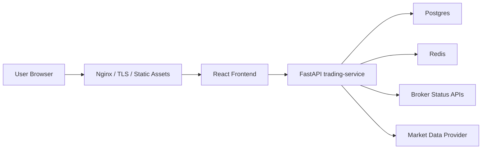
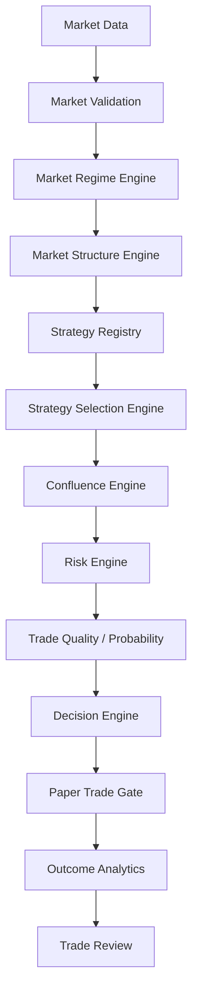

# QuantGrid Architecture

## Official Production Architecture

QuantGrid is a modular monolith first:

## Production Boundary

Production code lives in:

- `apps/frontend`
- `services/trading-service`
- `infra`
- `deploy`
- `scripts`
- `tests`
- `docs`

Placeholder microservices live in `experimental/` and are non-production.

## Runtime Responsibilities

- Nginx terminates TLS, serves the frontend, and proxies `/api` plus `/ws`.
- React handles the operator dashboard.
- FastAPI trading-service owns auth, audit logs, market data validation, signal generation, paper execution, broker status, websocket updates, and metrics.
- Postgres stores users, audit logs, and persistent application state in production.
- Redis carries websocket/job update events.

## Decision Intelligence Pipeline

Primary implementation: `services/trading-service/Backend/application/decision_pipeline.py`.

## AWS Deployment Shape

The Terraform baseline in `infra/terraform/aws` maps the modular monolith onto a 3-tier AWS network:

- Public tier: ALB in public subnets.
- Application tier: EC2 Auto Scaling Group in private subnets.
- Data tier: RDS Postgres and ElastiCache Redis in isolated subnets.

## Safety Principles

- Paper mode and live mode remain separated.
- Live trading fails closed unless explicitly enabled and broker credentials are configured.
- Market data is validated before execution.
- Admin and execution actions write audit logs.
- Production rejects SQLite.
